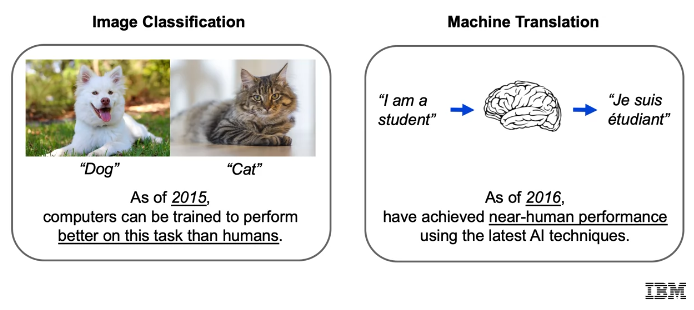
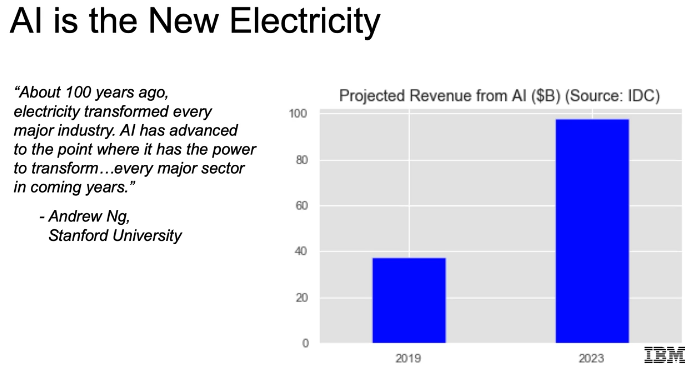
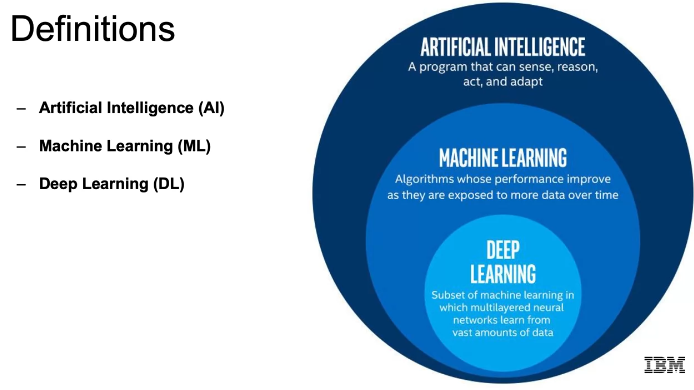

# Introduction to Artificial Intelligence and Machine Learning

- Define "Artificial Intelligence"(AI), "Machine Learning"(ML), and "Deep Learning"(DL)- Explain how DL helps solve classical ML limitations.
- Explain key historical developments, and the "Hype-Au winter cycle."
- Defferenties modern AI from classical AI.
- Relate Sample applications of AI

---

### AI Breakthroughs

---

### AI is the New Electricity

### Definitions

- **Artificial Intelligence (AI)**: The science of making machines smart, capable of performing tasks that typically require human intelligence.
- **Machine Learning (ML)**: A subset of AI that uses statistical techniques to enable machines to improve at tasks with experience.
- **Deep Learning (DL)**: A subset of ML that uses neural networks with many layers to model and solve complex problems.

---

### Artificial Intelligence (AI)

> "A Branch of computer science dealing with the simulation of intelligent behavior in computers." - Merriam-Webster

> "Colloquially, the term "artificial intelligence" is applied when a machine mimics "cognitive" functions that humans associate with other human minds, such as "learning" and "problem solving." - Wikipedia
